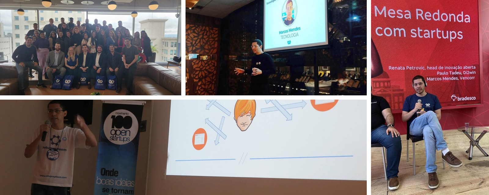

### Hi, I'm Marcos 👋

I'm a dreamer who happens to build software.

For 14+ years I've been an engineer and engineering leader across insurance, healthcare, industrial systems, government, and access control. I care less about any single technology and more about the shape of a problem: how it works, why it resists being solved, and what it would take to actually solve it. Currently Head of Engineering at Vencorr, remote from Brazil.

But engineering is just one language I use to chase the same thing everywhere: understanding.

### What drives me

I'm curious about almost everything, and I study far beyond my field. I love biology, and I'm fascinated by the human genome, how a few letters carry a whole person. My real ambition is to work on problems that no one has solved yet, the hard, open, unglamorous ones, and to leave things better than I found them.

> Be ashamed to die until you have won some victory for humanity.

### Things I've made

- 🔐 **[Coconui](https://usecoconui.com)** — encrypted note sharing, designed so the secrets never leave your browser unprotected.
- 🕸️ **[urltree](https://urltree.wiki)** — search the web as a link graph, with each site's sub-URLs as an expandable tree.
- 🤖 **[Discord Persona](https://github.com/marcoshmendes/discord-persona)** — an open-source agent with its own personality, memory, and boundaries.
- 🧩 **[Outlook Ad Blocker](https://chromewebstore.google.com/detail/outlook-ad-blocker/hpgeocgakdijfphkiakppebifapgclkc)** — a Chrome extension that strips the ads out of your Outlook inbox.
- ✍️ **[mendescraft.com](https://mendescraft.com)** — where I write about technology, ideas, and the craft of building things.
- 🎸 And on the side, I play guitar: [@theunfamousmusician](https://www.youtube.com/@theunfamousmusician).

### A bit of range

I started out close to the metal, with embedded systems: RFID readers, radio antennas, and access-control gates deployed in logistics, food production, and government. From there to distributed cloud systems and AI, the throughline has always been the same curiosity about how things work.

### PGP

To verify my signed messages or send me something encrypted:

- **Key:** [keys.openpgp.org](https://keys.openpgp.org/search?q=marcos.mendes%40live.com)
- **Fingerprint:** `003A 8B5A 198E 2F97 7588 CBC6 52F0 46BC 1199 C42F`

### Get in touch

- 📧 [marcos.mendes@live.com](mailto:marcos.mendes@live.com)
- 💼 [linkedin.com/in/marcoshmendes](https://www.linkedin.com/in/marcoshmendes/)

---

*Let's build a better world!* 🌎
